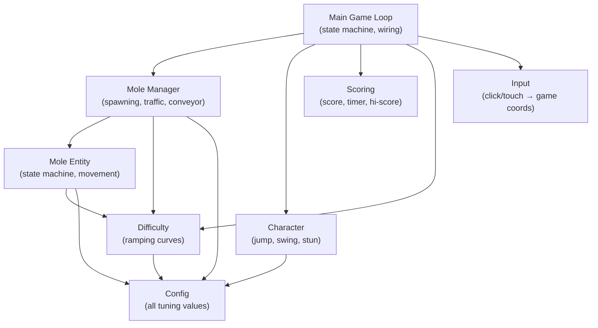
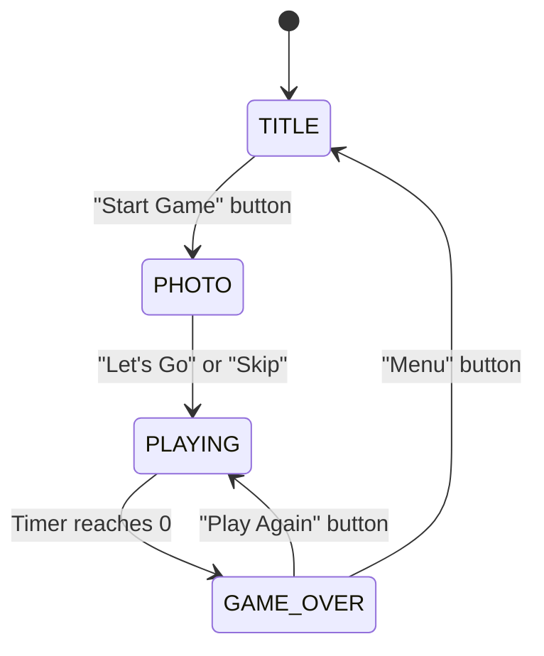
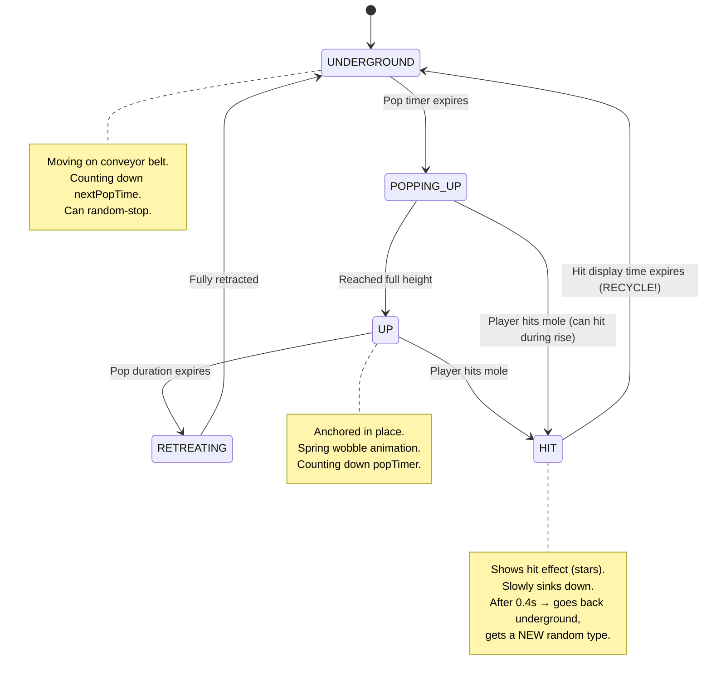
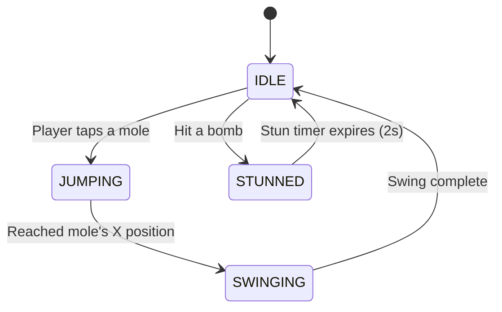

# Whack-a-Mole → Construct 3: Technical Handover for Jay

> Complete blueprint for rebuilding the prototype in Construct 3, with all game logic, tuning values, state machines, and recommended C3 mappings.

---

## Table of Contents
1. [Architecture Overview](#1-architecture-overview)
2. [Game Flow & State Machine](#2-game-flow--state-machine)
3. [Virtual Canvas & Layout](#3-virtual-canvas--layout)
4. [The Conveyor Belt System (Core Mechanic)](#4-the-conveyor-belt-system)
5. [Mole Lifecycle & State Machine](#5-mole-lifecycle--state-machine)
6. [Traffic & Queuing System](#6-traffic--queuing-system)
7. [Mole Types & Spawning](#7-mole-types--spawning)
8. [Character System](#8-character-system)
9. [Hit Detection & Click Handling](#9-hit-detection--click-handling)
10. [Scoring & Timer](#10-scoring--timer)
11. [Difficulty Ramping](#11-difficulty-ramping)
12. [Pause / Breathing Room System](#12-pause--breathing-room-system)
13. [Level System](#13-level-system)
14. [Visual Effects & Juice](#14-visual-effects--juice)
15. [Photo / Face System](#15-photo--face-system)
16. [HUD & UI Overlays](#16-hud--ui-overlays)
17. [Complete Parameter Reference](#17-complete-parameter-reference)
18. [Construct 3 Implementation Tips](#18-construct-3-implementation-tips)

---

## 1. Architecture Overview

The prototype is a pure JS/Canvas 2D game with no framework. All rendering is procedural (draw commands, not sprites). Your Construct 3 rebuild will replace all rendering with **Spine animations + sprite assets** but needs to replicate the **game logic** precisely.

### System Map



### What to Keep vs Replace

| Prototype Layer | Construct 3 Equivalent | Action |
|---|---|---|
| `rendering/*` (all drawing code) | Spine animations + Sprites | **Replace entirely** |
| `entities/*` (mole logic, character logic) | Event Sheets + Instance Variables | **Recreate the logic** |
| `systems/*` (scoring, difficulty) | Global Variables + Event Sheet logic | **Recreate the logic** |
| `config.js` (tuning values) | Global Variables or JSON project file | **Copy values directly** |
| `canvas.js` (resolution scaling) | C3 built-in viewport scaling | **Not needed** |
| `input.js` (click/touch) | C3 Touch/Mouse plugins | **Not needed** |
| `index.html` (DOM overlays) | C3 Layouts + Layer system | **Recreate as Layouts** |

---

## 2. Game Flow & State Machine

The game has **4 states**, each mapping to a Construct 3 Layout (or you could do it all on one Layout with visibility toggling):



### C3 Recommendation
- **Option A (Simple):** One Layout, 4 Layers for each screen. Toggle layer visibility.
- **Option B (Clean):** Separate Layouts for Title, Photo, Game, Game Over. Use `Go to layout` actions.
- Your existing Construct games likely already have a menu/loader layout, so reuse that pattern.

### Title Screen Elements
- Game title: "WHACK-A-MOLE!"
- Subtitle: "Smash those moles before time runs out!"
- **Level selection buttons:** LAWN, PUB, ROCK, BDAY (one active at a time, default: LAWN)
- "START GAME" button

### Photo Screen Elements
- "Add Your Face!" heading
- Camera button, Upload button, Snap/Retake buttons
- Skip button
- "LET'S GO!" button (appears after photo captured)

### Game Over Screen Elements
- "TIME'S UP!" heading
- Final score display
- Best score display
- "PLAY AGAIN" and "MENU" buttons

---

## 3. Virtual Canvas & Layout

| Property | Value |
|---|---|
| Virtual resolution | **1280 × 720** |
| Aspect ratio | 16:9 |
| Scaling mode | Scale to fit (letterbox) |

### Screen Zones (Y coordinates as % of 720px height)

```
┌──────────────────────────────┐ Y=0
│       SKY / BACKDROP         │
│    (level-specific art)      │
├──────────────────────────────┤ Y=252 (35% = HORIZON_Y)
│                              │
│        LAWN / PLAY AREA      │
│  (moles move L→R here)      │
│                              │
│    ● Character stands at     │
│      Y=282 (LAWN_TOP + 30)  │
│                              │
│    ● Mole lane at            │
│      Y=397 (60% of lawn)    │
│                              │
├──────────────────────────────┤ Y=576 (80% = LAWN_BOTTOM)
│        SOIL / BELOW          │
├──────────────────────────────┤ Y=634 (88% = SOIL_BOTTOM)  
│          HUD BAR             │
│  Score | Timer | Best Score  │
└──────────────────────────────┘ Y=720
```

### Key Y Positions (at 720px height)

| Constant | Value | Description |
|---|---|---|
| `HORIZON_Y` | 252 | Top of play area |
| `LAWN_TOP` | 252 | Same as horizon |
| `LAWN_HEIGHT` | 324 | Height of play area |
| `LAWN_BOTTOM` | 576 | Bottom of play area |
| `SOIL_TOP` | 576 | Below play area |
| `SOIL_BOTTOM` | 634 | Bottom of soil |
| `HUD_TOP` | 634 | Where HUD bar starts |
| Character Y | 282 | `LAWN_TOP + 30` |
| Mole base Y | 446 | `LAWN_TOP + LAWN_HEIGHT * 0.6` |
| Track/belt Y | 493 | Mole base Y + 47 |

---

## 4. The Conveyor Belt System

> [!IMPORTANT]
> This is the most unique and complex part of the game. It's not a standard whack-a-mole with fixed holes — moles travel across the screen on a horizontal conveyor belt.

### How It Works

1. Moles spawn **off-screen left** (x = -40)
2. They move **left → right** at individual speeds
3. They disappear when they go **off-screen right** (x > 1280 + 60)
4. When a mole goes off-screen, it's removed and a new one spawns from the left
5. The target pool is **6 moles** on screen at all times

### Movement Rules

- Each mole has its own `baseSpeed` derived from the config `moveSpeed` (120 px/s)
- On creation: `baseSpeed = 120 * random(0.8, 1.2)` — so 96–144 px/s range
- **Moles only move when underground** — popping up anchors them in place
- When a mole transitions from stopped → moving, it gets a **new random speed** (re-roll)
- Speed re-roll formula: `120 * random(0.7, 1.3)` (using `speedVariance: 0.3`)

### Random Stops

While moving underground, each mole has a **0.5% chance per frame** to randomly stop for **0.5–2.0 seconds**. This creates natural-looking variation in the conveyor flow rather than everything being mechanical.

### C3 Implementation
- Give each mole Sprite a `baseSpeed` instance variable
- In the event sheet tick: `If mole.state = "underground" → Set X to Self.X + Self.currentSpeed * dt`
- Use a `waitTimer` instance variable for random stops

---

## 5. Mole Lifecycle & State Machine

Each mole cycles through these states forever (they never truly die — they recycle):



### State Details

#### UNDERGROUND
- **Moves** along conveyor belt (left → right)
- Counts down `nextPopTime` — when it reaches 0, transitions to POPPING_UP
- Initial `nextPopTime`: random 1–3 seconds
- After hit/retreat: `nextPopTime = popUpInterval * random(0.8, 1.8)`
- Shows "dirt disturbance" or level-specific underground animation (gift box wobble, etc.)

#### POPPING_UP
- **Stops moving** (anchored at current X)
- `popOffset` increases at `popUpSpeed` (400 px/s) — the mole rises
- When `popOffset >= popUpHeight` (10 px) → transitions to UP
- On transition: apply spring wobble (`wobble = 10`, `wobbleVel = -200`)
- **Can be hit during this phase!**

#### UP
- **Stays anchored** at position
- `popTimer` counts down from `popDuration` (starts at ~2.5s, ramps down to ~1.0s)
- Spring wobble decays: `wobbleVel += -wobble * 800 * dt`, `wobbleVel *= 0.9`
- When `popTimer <= 0` → transitions to RETREATING

#### RETREATING
- `popOffset` decreases at `retreatSpeed` (1000 px/s) — very fast compared to rise (400)
- When `popOffset <= 0` → back to UNDERGROUND
- On transition: **re-randomize type** and set new `nextPopTime`

#### HIT
- Shows hit effect for `hitDisplayTime` (0.4 seconds)
- Slowly sinks: `popOffset -= retreatSpeed * 0.5 * dt`
- When timer expires → UNDERGROUND, **re-randomize type**, longer delay before next pop

### Instance Variables Needed per Mole in C3

| Variable | Type | Description |
|---|---|---|
| `state` | Text | Current state (underground/popping_up/up/hit/retreating) |
| `type` | Text | Mole type (normal/hardhat/bomb/golden) |
| `popOffset` | Number | How far above ground (0 = underground) |
| `popTimer` | Number | Countdown while popped up |
| `popDuration` | Number | How long to stay up (set on pop) |
| `hitTimer` | Number | Countdown for hit display |
| `nextPopTime` | Number | Countdown until next pop attempt |
| `wobble` | Number | Spring wobble displacement |
| `wobbleVel` | Number | Spring wobble velocity |
| `baseSpeed` | Number | Individual movement speed |
| `currentSpeed` | Number | Actual speed (after traffic limits) |
| `waitTimer` | Number | Random stop duration |
| `dirtPhase` | Number | Animation phase for underground visuals |
| `hitsRemaining` | Number | Hits needed (1 for normal, 2 for hardhat) |

---

## 6. Traffic & Queuing System

> [!IMPORTANT]
> This prevents moles from overlapping and creates natural train-like queuing behaviour.

### Algorithm (runs every tick)

1. **Sort all moles by X position, rightmost first** (the leader is at the highest X)
2. For each mole (except the leader), check distance to the mole directly ahead:

```
distance = leaderMole.x - thisMole.x

if distance < 90 (minSafeDist):
    → HARD STOP: speedLimit = 0 (panic brake!)
    
else if distance < 150 (followDist):
    → MATCH SPEED: speedLimit = leader.currentSpeed
    
else:
    → FREE: speedLimit = 9999 (no limit)

final speed = min(targetSpeed, speedLimit)
```

### Parameters

| Parameter | Value | Description |
|---|---|---|
| `minSafeDist` | 90 px | Hard brake distance (moles stop) |
| `followDist` | 150 px | Match leader speed (flow control) |
| `speedVariance` | 0.3 | Speed randomization factor (±30%) |

### Optional: Global Freeze Mode

There's a config flag `stopOnPop` (currently `false`). When `true`, ALL moles stop when ANY mole is popped up. This was an early concept but the current game uses the more natural independent-pop approach.

### C3 Implementation
- Process moles ordered by X (use `For each Mole ordered by X descending`)
- Use a family or pick-nearest logic to find "mole ahead"
- Set `currentSpeed` based on distance checks

---

## 7. Mole Types & Spawning

### Types

| Type | Visual | Hits to Kill | On Hit Effect | Spawn Chance |
|---|---|---|---|---|
| **Normal** | Brown mole | 1 | +1 point, +1s time | Remainder after bombs+hardhats |
| **Hard Hat** | Mole + yellow hat | 2 | 1st hit: "CRACK!" (hat cracks, extended timer). 2nd hit: +2 points, +1s | Start 10% → ramps to 40% |
| **Bomb** | Black bomb w/ fuse | 1 | **Stuns player** for 2s! No points | Start 20% → ramps to 30% |
| **Golden** | Gold mole + sparkles | 1 | +5s bonus time, no points | Every 30s (forced timer) |

### Spawning Logic

- **Pool size target:** 6 moles on screen
- When a mole goes off-screen right, it's removed
- If pool < 6 and not paused → spawn timer counts down
- Spawn interval: starts at 1.2s, ramps to 0.6s (with ±30% randomization)
- New moles spawn at x = -40 (just offscreen left)

### Type Selection on Spawn

```
roll = random(0, 1)

if timeSinceGolden >= 30s:
    type = GOLDEN (forced!)
    reset golden timer
else if roll < bombChance:
    type = BOMB
else if roll < bombChance + hardHatChance:
    type = HARDHAT
else:
    type = NORMAL
```

### Type Re-randomization

Moles get a **new random type** when:
- They are **hit** and recycle back underground
- They **retreat naturally** (pop timer expired without being hit)

So the same mole slot can be a bomb one time and a normal the next.

---

## 8. Character System

The player character stands at the **back of the play area** (Y = 282), behind the mole lane.

### Character States



### Movement Constants

| Parameter | Value | Description |
|---|---|---|
| `JUMP_SPEED` | 3600 px/s | Horizontal movement speed (very fast!) |
| `SWING_DURATION` | 0.15s | Total swing animation time |
| Hit frame | 0.075s | Hit callback fires at 50% of swing |
| `STUN_DURATION` | 2.0s | Player disabled after hitting bomb |
| X bounds | 60 – 1220 | Character can't go off-screen |

### Jump & Swing Sequence

1. Player taps a popped mole
2. Character **slides horizontally** to mole's X at 3600 px/s
3. On arrival: starts **swing animation** (0.15s)
4. At the **midpoint of swing** (0.075s): **hit callback fires** → check mole hit result
5. Swing completes → back to idle

> [!NOTE]
> The character moves to the mole's X only (horizontal), staying at fixed Y. The "jump" is actually a horizontal slide with a slight upward bob (-8px on Y during movement). This will likely be a Spine animation of the character sliding/running.

### Stun Behaviour

When the player hits a bomb:
- Character enters STUNNED state
- All input disabled for 2.0 seconds
- Character sways side-to-side: `sway = sin(progress * 20) * 8 * (1 - progress)` — fast oscillation that dampens
- Stars orbit the head
- Red vignette overlay on screen
- "STUNNED!" text appears

### Idle Breathing

A subtle vertical bob while idle: `breathe = sin(idleTimer * 2.5) * 2` — ±2px at ~0.4Hz

### C3 Implementation
- Character is a single Sprite/Spine object
- Use instance variables for state tracking
- The "jump" can be a `Move to` action or lerp X toward target
- Fire the hit check via a timer or animation event at swing midpoint
- Spine animations: idle, run/slide, swing, stunned

---

## 9. Hit Detection & Click Handling

### Click Flow

```
Player taps screen
  → Convert screen coords to game coords (C3 handles this automatically)
  → Check: is game state PLAYING?
  → Check: is character NOT stunned?
  → Search all popped moles for hit
  → If found: start character jump-and-swing to that mole
  → Hit callback fires at swing midpoint
  → Check mole.tryHit() result
  → Apply effects based on result
```

### Mole Hit Boxes

Only moles in `POPPING_UP` or `UP` state can be hit. Hit box per mole (in game coordinates):

| Property | Value |
|---|---|
| Hit box X | `mole.x - 70` |
| Hit box Y | `visibleY - 90` |
| Hit box Width | 140 px |
| Hit box Height | 130 px |

These are generous for easy tapping. The visual mole is smaller (~44px wide body at 1.6x scale).

### Hit Results & Effects

| Result | Condition | Effects |
|---|---|---|
| **hit** | Normal/Golden mole, or hardhat with 0 hits remaining | +1 point (or +2 for hardhat), +1s time, score popup, screen shake (4, 0.15s) |
| **cracked** | Hardhat with hits remaining > 0 | Hat cracks visually, wobble (15, -300), extended pop timer (2.5s), "CRACK!" popup, screen shake (2, 0.1s) |
| **bomb** | Hit a bomb mole | Stun player! Screen shake (10, 0.4s) |
| **golden** | Hit a golden mole | +5s time bonus, "+5s!" popup, screen shake (6, 0.2s) |

### C3 Implementation
- Use `Touch/Mouse > On tap/click` → `Pick Mole overlapping point`
- Or: get all moles where state is UP or POPPING_UP, check if click point is inside hit box
- Since moles are ordered, check in **reverse X order** (rightmost first) so topmost visual mole is hit

---

## 10. Scoring & Timer

### Score

- Start: **0**
- Normal mole hit: **+1 point**
- Hard hat mole killed (2nd hit): **+2 points**
- Golden mole: **+0 points** (time bonus only)
- Bomb: no points, stuns player

### Timer

- Start: **30 seconds** (counting down)
- Every normal/hardhat mole hit: **+1 second** added
- Golden mole hit: **+5 seconds** added
- Time runs down in real-time
- Game ends when timer reaches 0

### High Score

- Persisted in `localStorage` under key `whackamole_hiscore`
- Updated at game over if current score > saved best
- In Construct: use the **LocalStorage plugin** or **WebStorage** for persistence

---

## 11. Difficulty Ramping

All difficulty parameters smoothly interpolate from a **start** value to an **end** value over a **rampTime** (in seconds of gameplay elapsed).

### Interpolation Formula

```
progress = clamp(elapsedTime / rampTime, 0, 1)
value = start + (end - start) * progress
```

This is a simple linear lerp, clamped at 1.0 (the value stops changing after rampTime).

### Difficulty Curve Parameters

| Parameter | Start Value | End Value | Ramp Time | Effect |
|---|---|---|---|---|
| `popUpDuration` | 2.5s | 1.0s | 60s | Moles stay up shorter → harder to hit |
| `maxSimultaneous` | 3 | 3 | 60s | Max moles popped at once (currently constant) |
| `bombChance` | 0.20 (20%) | 0.30 (30%) | 60s | More bombs over time |
| `hardHatChance` | 0.10 (10%) | 0.40 (40%) | 60s | More hard hats over time |
| `spawnInterval` | 1.2s | 0.6s | 60s | Moles spawn faster |
| `popUpInterval` | 2.0s | 1.0s | 60s | Moles pop up more frequently |

> [!TIP]
> All ramp times are currently 60 seconds. The game gets noticeably harder around the 30-second mark and reaches full difficulty at 60s. Since the timer starts at 30s and you earn +1s per hit, a good player will push well past 60s elapsed time.

### C3 Implementation
- One global variable `elapsed` that increments each tick: `elapsed = elapsed + dt`
- For each parameter, calculate: `lerp(start, end, min(elapsed / rampTime, 1))`
- You could use C3's built-in `lerp()` expression

---

## 12. Pause / Breathing Room System

After a random number of moles have been spawned, the spawner takes a **pause** — no new moles enter from the left. This creates natural breathing room as the existing conveyor clears.

### Parameters

| Parameter | Value |
|---|---|
| `minMolesBeforePause` | 8 |
| `maxMolesBeforePause` | 15 |
| `pauseDuration.min` | 2.0s |
| `pauseDuration.max` | 4.0s |

### Logic

1. After each spawn, increment `molesSpawnedSincePause`
2. Before the game starts, pick a random target: `molesToNextPause = random(8, 15)` (integer)
3. When `molesSpawnedSincePause >= molesToNextPause`:
   - Set `isPaused = true`
   - Set `pauseTimer = random(2.0, 4.0)`
4. During pause: no new moles spawn, existing moles continue normally
5. When `pauseTimer` expires:
   - Set `isPaused = false`
   - Reset `molesSpawnedSincePause = 0`
   - Pick a new random target for next pause
   - Immediately allow spawning (spawn timer = 0)

---

## 13. Level System

The game has **4 levels** that change the visual theme only — game mechanics are identical across all levels.

| Level | Visual Theme | Container | Weapon | Character Outfit |
|---|---|---|---|---|
| **Lawn** | Garden, sky, hills, trees | Dirt holes | Hammer | Red shirt, blue jeans |
| **Pub** | Dark pub, bar counter, wooden floor | Barrel | Hammer | Same |
| **Rock** | Concert venue, spotlights, crowd | Crowd gaps | Electric guitar | Leather jacket, punk hair, platform boots |
| **Birthday** | Party room, balloons, confetti, disco ball | Gift boxes | Piñata stick | Striped party shirt, party hat, bow tie |

### What Changes Per Level

1. **Background rendering** — entirely different scene per level
2. **Mole containers** — what the mole emerges from (holes vs barrels vs crowd vs gifts)
3. **Underground animation** — dirt disturbance vs barrel wobble vs crowd parting vs gift box jiggle
4. **Character appearance** — outfit, head gear, weapon
5. **Track/belt visual** — conveyor belt (pub), rail track (birthday), or implicit

### What Stays the Same Across All Levels

- All gameplay mechanics
- Mole movement speeds, traffic logic
- Difficulty curves
- Scoring and timer
- Hit detection and hit boxes
- Character jump/swing/stun timing

### C3 Implementation
- Use a **global variable** `selectedLevel` (text: "lawn", "pub", "rock", "birthday")
- Swap Sprite frames or use different animation names based on level
- Switch background layers/objects based on level
- Spine animations can have different skins per level

---

## 14. Visual Effects & Juice

### Screen Shake

Triggered on hits. Applies random X/Y translation to the entire canvas each frame while active.

| Trigger | Intensity (px) | Duration (s) |
|---|---|---|
| Normal hit | 4 | 0.15 |
| Hard hat crack | 2 | 0.10 |
| Golden hit | 6 | 0.20 |
| Bomb hit | 10 | 0.40 |

**Implementation:** `offsetX = random(-intensity, intensity)`, `offsetY = random(-intensity, intensity)`. Intensity stays constant then drops to 0 when timer expires.

C3: Use `Shake` behavior or manually set layer scroll offsets.

### Spring Wobble (Mole Pop-Up)

When a mole reaches the UP state, it has a spring effect:
- `wobble` starts at 10 (pixels of horizontal displacement)
- `wobbleVel` starts at -200
- Each tick: `wobbleVel += -wobble * 800 * dt` then `wobbleVel *= 0.9` then `wobble += wobbleVel * dt`
- This creates a dampened oscillation — the mole bounces side to side and settles

On hardhat crack, stronger wobble: `wobble = 15, wobbleVel = -300`

### Score Popups

Floating text that rises and fades:
- Spawns at mole position (Y - 40)
- Rises at 40 px/s
- Fades over 0.8 seconds
- Text: "+1", "+2", "CRACK!", "+5s!"
- Color: gold (#FFD54F) by default, green (#4CAF50) for time bonuses

### Time Bonus Popups

"+1s" text near the HUD area:
- Random X spread (±50px from center)
- Rises at 40 px/s
- Fades over 1.0 seconds
- Color: green (#4CAF50)

### Stun Overlay

When stunned:
- **Red radial vignette** covering the screen, fading with stun progress
- **"STUNNED!"** text at 25% screen height, fading after 70% of stun duration
- **Stars** orbiting the character's head (5 stars, spinning, yellow ★)

### Hit Effect on Mole

- Mole "squashes": scale = `0.5 + (hitTimer/0.4) * 0.5` — starts at full, squashes to 50%
- Stars (★) orbit outward from mole, fading
- Mole slowly sinks (half retreat speed)

### Golden Mole Sparkles

3 sparkles orbit the golden mole in a ring:
- 4-point star shapes
- Rotate at varying speeds
- Pulse opacity between 0.2 and 1.0

### Urgent Timer

When timer ≤ 10 seconds:
- Timer text turns red (#F44336)
- Timer text size increases (32 → 36px)
- Pulsing glow effect: `opacity = sin(time * 0.015) * 0.3 + 0.7`
- **"HURRY!"** text appears at 15% screen height, pulsing with same effect

---

## 15. Photo / Face System

The prototype allows players to upload or capture a selfie, which gets composited onto the player character's head.

### Flow
1. On the **Photo screen**, player can:
   - **Use Camera** → starts webcam → **Snap Photo** → captures frame
   - **Upload File** → file picker for image
   - **Skip** → uses a default smiley face
2. The image is **cropped to an oval** (200 x 250px canvas)
3. The face oval is drawn clipped to the character's circular head during gameplay

### Cropping Logic
- Take center square of source image
- Bias Y toward top by 30% (faces are usually in upper portion)
- Apply elliptical clip mask
- Output: 200 x 250px canvas

### C3 Implementation

> [!NOTE]
> You mentioned your existing Construct games already have an API for pulling in character faces — this system maps directly to that. The prototype's face is simply drawn into the character's head circle. In C3, draw the face sprite on a layer beneath the character body, masked/clipped to the head shape.

---

## 16. HUD & UI Overlays

### HUD Bar (Bottom 12% of screen)

| Element | Position | Style |
|---|---|---|
| "SCORE" label + value | Left (x=30) | Small label, large gold number |
| "TIME" label + countdown | Center | Small label, large white number. Red + pulsing when ≤10s |
| "BEST" label + hi-score | Right (VIRTUAL_WIDTH - 30) | Small label, medium white number |

### Font
The prototype uses **Outfit** (Google Font), weights 600 and 900. You can use any clean sans-serif in C3.

---

## 17. Complete Parameter Reference

### Movement & Physics (`MOLE_CONFIG`)

| Parameter | Value | Unit | Note |
|---|---|---|---|
| `moveSpeed` | 120 | px/s | Base conveyor speed |
| `popUpSpeed` | 400 | px/s | Rising from ground |
| `popUpHeight` | 10 | px | Max height above ground |
| `retreatSpeed` | 1000 | px/s | Going back underground (2.5x faster than rising) |
| `hitDisplayTime` | 0.4 | s | Show hit effect before recycling |
| `visualScale` | 1.6 | multiplier | Size of rendered mole |
| `stopOnPop` | false | bool | Global freeze when mole pops (disabled) |

### Traffic (`TRAFFIC_CONFIG`)

| Parameter | Value | Unit |
|---|---|---|
| `minSafeDist` | 90 | px |
| `followDist` | 150 | px |
| `speedVariance` | 0.3 | fraction |

### Difficulty (`DIFFICULTY_CURVE`)

| Parameter | Start | End | Ramp Time |
|---|---|---|---|
| `popUpDuration` | 2.5s | 1.0s | 60s |
| `maxSimultaneous` | 3 | 3 | 60s |
| `bombChance` | 0.20 | 0.30 | 60s |
| `hardHatChance` | 0.10 | 0.40 | 60s |
| `spawnInterval` | 1.2s | 0.6s | 60s |
| `popUpInterval` | 2.0s | 1.0s | 60s |

### Pause (`PAUSE_CONFIG`)

| Parameter | Value |
|---|---|
| `minMolesBeforePause` | 8 |
| `maxMolesBeforePause` | 15 |
| `pauseDuration.min` | 2.0s |
| `pauseDuration.max` | 4.0s |

### Golden Mole (`GOLDEN_CONFIG`)

| Parameter | Value |
|---|---|
| `spawnInterval` | 30s |
| `bonusTime` | +5s |
| `score` | 0 |

### Hard Hat (`HARD_HAT_CONFIG`)

| Parameter | Value |
|---|---|
| `recoverTime` | 2.5s |

### Game Setup (`GAME_SETUP`)

| Parameter | Value |
|---|---|
| `initialMoles` | 6 |

### Character Constants

| Parameter | Value |
|---|---|
| `JUMP_SPEED` | 3600 px/s |
| `SWING_DURATION` | 0.15s |
| `STUN_DURATION` | 2.0s |
| Starting timer | 30s |

---

## 18. Construct 3 Implementation Tips

### Recommended Object Structure

| C3 Object | Type | Purpose |
|---|---|---|
| `Mole` | Sprite or Spine | The mole characters, using instance variables for state |
| `Character` | Sprite or Spine | Player character |
| `Background` | TiledBackground or Sprite | Level-specific backgrounds |
| `Container` | Sprite or Spine | Holes/barrels/gifts/crowd gaps |
| `HUD` | Text objects | Score, timer, best |
| `ScorePopup` | Text or Sprite | Floating "+1", "+2" popups |
| `StunOverlay` | Sprite | Red vignette effect |

### Event Sheet Structure

1. **Global Variables** — all config values from section 17
2. **On Start of Layout** — initialize scoring, difficulty, spawn initial moles
3. **Every Tick** — difficulty ramping, mole updates, traffic logic, character update, timer
4. **On Tap** — find nearest popped mole, trigger character jump
5. **Mole State Machine** — sub-events for each state transition
6. **Spawning** — timer-based spawning with pause system

### Key Construct 3 Features to Use

- **Instance Variables** on Sprites — for all mole and character state
- **Families** — group all mole types if using separate sprites
- **Custom Actions/Functions** — for the difficulty lerp, traffic calculation
- **Timer Behavior** — for delayed actions (hit display, stun recovery)
- **Sine Behavior** — for wobble effects, breathing animation
- **Shake Effect** — for screen shake (or use ScrollTo + random offset)
- **Spine Plugin** — for character and mole animations
- **LocalStorage** — for high score persistence

### Things to Watch Out For

> [!CAUTION]
> - **Pop-up check requires counting active pops.** Before popping a mole, count how many are currently up and compare to `maxSimultaneous`. Don't just use a simple timer.
> - **Traffic sort order matters.** Always process the rightmost (leader) mole first, then work backwards. If you process left-to-right, followers can't correctly adapt to leader speed.
> - **Hit callback timing is critical.** The hit check must fire at the midpoint of the swing animation, not at the start. This creates the satisfying "whack" timing.
> - **Moles recycle, they don't die.** Never destroy a mole object — reuse it. The pool stays at 6. Only remove when off-screen right, then spawn a fresh one from the left.
> - **Type re-randomization happens on BOTH hit AND natural retreat.** This is important for variety.

---

> Built from prototype source at `/Users/chris/molegame/` • Feb 2026
